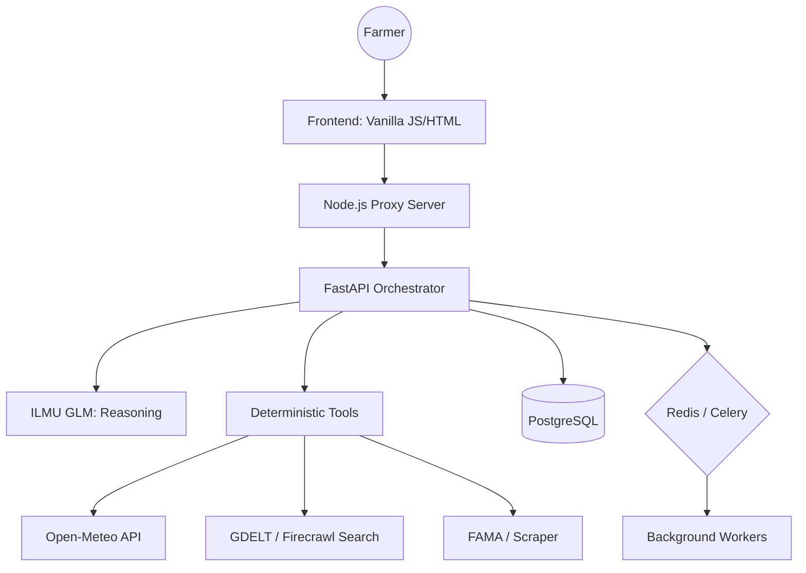

# 🌾 HarvestMind
### *Data-Driven Decisions for the Modern Malaysian Farmer*

[](https://fastapi.tiangolo.com/)
[](https://nodejs.org/)
[](https://www.postgresql.org/)
[](https://redis.io/)
[](https://www.docker.com/)

---

**HarvestMind** is a decision intelligence platform designed to empower Malaysian farmers. By grounding advanced AI (ILMU GLM) in real-time market prices, weather forecasts, and news signals, HarvestMind helps farmers answer the critical question: **Should I persevere, pivot, or harvest early?**

NOTE: You can view Demo video [here](https://youtu.be/xF5qp4EL0WA?si=Zowxb9eKPryKcYYI).
NOTE: If you want, you can try a lite version of it on [here](https://sparklab-0yw7.onrender.com).

## ✨ Key Features

- **💬 Conversational Farm Intake**: No complex forms. Just talk to the AI about your farm's location, crops, and current stage.
- **🔍 Web-Powered Discussions**: The free chat uses a local **Firecrawl** instance to search the live web for real-time agricultural trends during your discussions.
- **📈 Live Market Monitoring**: Real-time pricing and trend analysis for **6+ critical Malaysian crops** via FAMA and web-scraping fallbacks.
- **⚡ Decision Orchestrator**: High-fidelity reasoning with **real-time progress logs** (SSE) that weigh weather risks and news events against farm profiles.
- **📅 Automated Signal Cards**: Weekly generated risk and opportunity cards for the Malaysian agricultural landscape.

---

## 🏗️ Architecture

HarvestMind is built as a **modular monolith** designed for speed and reliability:



---

## 🚀 Quick Start

### 1. Prerequisites
- [Docker & Docker Compose](https://docs.docker.com/get-docker/)
- [ILMU API Key](https://api.ilmu.ai/) (for AI reasoning)

### 2. Launch the Stack

Choose your preferred way to start the ecosystem:

```bash
# Setup environment
cp .env.example .env

# Start stack manually
docker compose up --build --remove-orphans
```

### 3. Access
- **Frontend Dashboard**: [http://localhost:3000](http://localhost:3000)
- **API Documentation**: [http://localhost:8000/docs](http://localhost:8000/docs)
- **Local Firecrawl (Scraper)**: [http://localhost:3002](http://localhost:3002)

---

## 🛠️ Tech Stack

| Layer | Technology |
| :--- | :--- |
| **Frontend** | Vanilla JS, HTML5, CSS3 (Modern Responsive UI) |
| **Proxy / Static** | Node.js |
| **Backend API** | Python 3.11+, FastAPI |
| **AI / Intelligence** | ILMU GLM |
| **Database** | PostgreSQL 16 |
| **Task Queue** | Celery + Redis |
| **Web Scraping** | Firecrawl (Self-hosted) |

---

## 📦 Project Structure

- `api/`: The heart of the platform. FastAPI service, repositories, and domain logic.
- `firecrawl-local/`: Dedicated self-hosted scraper instance for real-time web intelligence.
- `public/`: Pure, high-performance frontend pages (HTML/CSS).
- `server.js`: Lightweight Node.js server for UI delivery and secure API proxying.

---

## 🩺 Troubleshooting

```bash
./doctor.sh
```

---

## 🤝 Contributing

We welcome contributions! Whether it's adding new crop adapters, improving the reasoning prompts, or enhancing the UI, please check out our [AGENTS.md](AGENTS.md) for development guidelines.

---

## 📄 License & Disclaimer

*HarvestMind is a prototype decision-support tool. Agricultural decisions should always be cross-referenced with local agricultural officers and market reality. All predictions are based on available digital signals and AI modeling.*

---
<p align="center">
  Built with ❤️ for the farmers of Malaysia.
</p>
